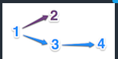
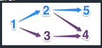
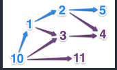

La citation "Des nains sur des épaules de géants" se réfère à l'importance pour tout homme de s'appuyer sur les travaux de ses prédécesseurs.
 
À la lecture des textes, on ne glane qu'une petite partie de cette dépendance : telle personne a influencé telle autre personne. On apprendra par la suite que cette seconde personne en a, à son tour, influencé une troisième, et ainsi de suite. C'est cette chaîne d'influence qui nous intéresse dans cet exercice, et plus précisément, il s'agit de trouver la longueur de la plus grande de ces chaînes.

Règles

On choisit de représenter chaque personne par un nombre entier distinct. Si la personne `1` a influencé les personnes `2` et `3`, et que `3` a influencé `4`, alors il existe une succession de pensée entre `1`, `3` et `4`. C'est la plus longue succession existante dans ce cas, et le résultat attendu sera **3** car elle implique 3 personnes.

Si on complète cet exemple en apprenant que `2` a également influencé `4` et `5`, la plus longue succession reste de longueur 3, mais il en existe désormais plusieurs.

Si on ajoute que `10` a influencé `11`, le résultat reste 3. Mais dès que l'on apprend que `10` a également influencé `1` et `3`, alors le résultat devient **4**, car il existe alors par exemple la succession `10`, `1`, `2`, `5` comportant 4 personnes.

**Note**: Il faut du temps pour qu'une pensée en influence d'autres. Ainsi, on supposera qu'il n'est pas possible d'avoir d'influence mutuelle entre les personnes. Autrement dit, si `A` influence `B` (même indirectement via d'autres personnes), alors `B` n'influencera pas `A` (même indirectement). Il est également impossible de s'influencer soi-même.

Entrée
Ligne 1 : le nombre `N` de relations d'influence.

`N` lignes suivantes : une relation d'influence entre deux personnes, de la forme `X` (espace) `Y`, indiquant que `X` influence `Y`. Les relations d'influence sont listées dans un ordre quelconque.

Sortie
Le nombre de personnes impliquées dans la plus longue succession d'influences.
Contraintes
0 < `N` < 10000
0 < `X`, `Y` < 10000

Exemples

Entrée

3

1 2

1 3

3 4

Sortie

3

Entrée

8

1 2

1 3

3 4

2 4

2 5

10 11

10 1

10 3

Sortie

4